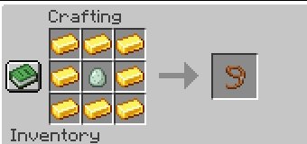

# Mob Egg Capture

This server-side only Fabric mod adds a Safari Nets that you throw use to
capture friendly and hostile mobs to be released later.

Recipe for Safari Net:

- Any egg can be used for crafting (normal, brown or blue)
- Safari Nets are single-use and consumed when the captured mob is released.
- Hostile mobs must have Weakness to be captured by single-use Safari Nets. Bosses cannot be captured.
- Safari Nets can be found as loot in desert pyramids, jungle temples, abandoned mineshafts and dungeons. 
- Reusable Safari Nets can be found in End Cities. They are multi-use and do not require weakness to capture hostile mobs.
- Dispensers can utilize Safari Nets similar to players.
- Mobs cannot pick up Safari Nets (even when they can pick up equipment, like some Zombies)

## Installation

This mod requires Fabric API to be installed. Mod does not need to be installed on the client.
